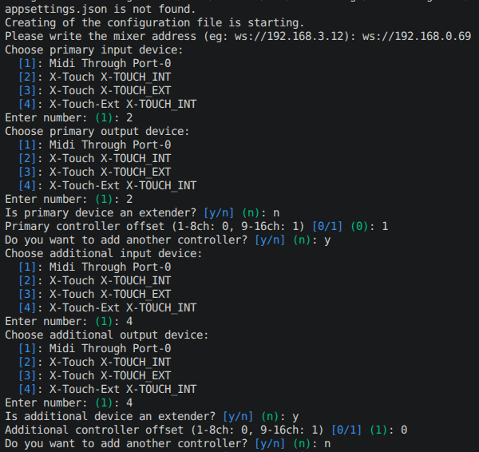

# UI24RBridge
Bridge between the UI24R and MIDI controllers. Any number of controllers are supported as long as they are named differently.\
This is a beta project. It was tested on Windows, Ubuntu and Raspbian with Behringer X-Touch and X-Touch extender MIDI controllers.

You can download the [latest release here](https://github.com/MatthewInch/UI24RBridge/releases/latest). Note that the MacOS binary wasn't tested.

For Raspberry Pi or other linux distributions, see instructions [here](Linux.md)

Implemented the Mackie Control protocol (It can work with any DAW controller that can use in MC mode).\
The earlier protocol has not been removed but the new functions only implemented in MC mode.

### The Bridge functionalities:
 - Use 3 groups with 6 layers of faders for each bank
	- Bank I
		- Layer 1: Input 1-8
		- Layer 2: Input 9-16
		- Layer 3: Input 17-24
		- Layer 4: Line in, Player, FX 1-4
		- Layer 5: AUX 1-8
		- Layer 6: AUX 9-10; VCA 1-6
	- Bank U (user defined layers, load from ViewGroups.json file, initially the same as Bank I)
		- Layer 1: User defined
		- Layer 2: User defined
		- Layer 3: User defined
		- Layer 4: User defined
		- Layer 5: User defined
		- Layer 6: User defined
		- If you want to edit user bank, select channel in user group, hold ***Set User Channel*** button and select new channel with JOG wheel while still holding ***Set User Channel*** button.
		- Changes must be saved with ***Save User Layer*** button, otherwise changes will be discarted on app restart
	- Bank V (configurable with Global View Groups in mixer app)
		- Layer 1: VIEW 1 (if set)
		- Layer 2: VIEW 2 (if set)
		- Layer 3: VIEW 3 (if set)
		- Layer 4: VIEW 4 (if set)
		- Layer 5: VIEW 5 (if set)
		- Layer 6: VIEW 6 (if set)
		- The controller shows the first 8 channel (16 channel with secondary controller) of the selected global view.
		- Press the ***View Group 1–6*** buttons to jump directly to the corresponding view layer (V1–V6) without cycling through banks. The LED of the active view group lights up; all view group LEDs go dark when leaving Bank V.
	- Switch between Banks with ***Fader Bank <<*** and ***Fader Bank >>*** buttons or K (up) and J (down) key on the computer
	- Switch between Layers in current bank with ***Channel Bank <<*** and ***Channel Bank >>*** buttons or M (up) and N (down) key on the computer
 - The ***faders*** work on every type of channels
 - The ***knobs*** set the gain on the input channels or Panorama (change the behavior with ***Pan*** button; use ***Gain*** button to switch back)
 - Channel ***Select***, ***Solo*** and ***Mute*** buttons work on every channel
 - Channel ***Rec*** button sets either Mtk rec or Phantom 48V (selected in appsettings.json)
 - Channel strip LCD **second line** shows the channel identifier (e.g. CH01, FX03) and, when viewing AUX/FX sends, appends the send suffix (e.g. CH01-A2, CH05-F1)
 - Channel strip **colours** indicate channel type:
	- **White** — input, line-in, player and main channels
	- **Yellow** — AUX channels, or any channel when viewing an AUX send layer
	- **Cyan** — FX channels, or any channel when viewing an FX send layer
	- **Magenta** — subgroup channels
	- **Green** — VCA channels
	- **Black** — empty/unassigned strip
 - Buttons ***F1-F8*** switch to AUX1-8 sends
 - Button ***Switch***, ***Option***, ***Control*** and ***Alt*** switch to FX1-4 sends
 - Control Media player with ***<<***, ***>>***, ***Stop***, ***Play*** buttons
 - Start Recording with ***Rec*** button
 - ***Save User Layer*** button to save Layer Banks U
 - ***Tap Tempo*** Button to Tap Tempo
 - Automation buttons (***Read/Off***, ***Write***, ***Trim***, ***Touch***, ***Latch***, ***Group***) to control Mute Groups
 - ***Mute All*** button to Mute All
 - ***Mute FX*** button to Mute FX
 - ***Clear Mute*** button to Clear Mute
 - ***Clear Solo*** button to Clear Solo
 - ***Talkback*** button to mute/unmute the talkback channel (set it in config file)

### Controller Overlay

A physical overlay for the X-Touch controller is provided in [Overlays/overlay.svg](Overlays/overlay.svg) for reference.

The overlay labels the buttons with their UI24R functions as mapped by default. Print it and place it over the controller to identify button positions at a glance:

| Button label on overlay | Function |
|---|---|
| **Gain** | Switch knobs to Gain mode |
| **Pan** | Switch knobs to Pan mode |
| **Tap Tempo** | Tap Tempo |
| **Save User Layer** | Save Bank U layer assignments |
| **Set User Channel** | Hold + JOG wheel to reassign a channel in Bank U |
| **Mute All** | Toggle Mute All |
| **Mute FX** | Toggle Mute FX |
| **Clear Mute** | Clear all mutes |
| **Clear Solo** | Clear all solos |
| **Talkback** | Hold to unmute the configured talkback channel |

### Future functions
 - HPF

### Configuration
You can generate the config file at the first run. The program will ask a few questions: the mixer address, then the primary controller, and keep asking if you want to add more controllers until you say no.

See [appsettings.example.json](UI24RBridgeTest/appsettings.example.json) for a full example configuration.

In the settings file (**appsettings.json**):
- **UI24R-Url**: the mixer url (simply copy the url from the browser and replace http to ws and remove the /mixer.html from the end)
- **MidiControllers**: array of controller objects. Each entry has:
  - **InputName**: MIDI input device name
  - **OutputName**: MIDI output device name
  - **IsExtender**: `false` for a primary controller, `true` for an extender. If the controller channel LCD is not working try `true`.
  - **ChannelOffset**: `0` means the controller starts at the first layer, `1` means the second layer (useful when using two controllers side by side)
  - **PrimaryButtonsConfig**: config file name for button behaviour. You can redefine button functionality.
- **Protocol**: MC or HUI, or empty (for now use **MC**)
- **SyncID**: if you want to use the select button you can set the syncID to the same value that you use in the mixer's default surface (you can set it on the Settings/Locals page)
- **DefaultRecButton**: If you press the rec button on the controller, the bridge start/stop the MTK and/or 2 track recording it depend the value of the "DefaultRecButton". Possible value is: **onlyMTK**, **only2Track**, **2TrackAndMTK**
- **DefaultChannelRecButton**: Sets what function has a rec button on controller. You can use **phantom** for controlling phantom voltage or **rec** to set multi-track recording for this channel; default is "rec"
- **AuxButtonBehavior**: If you want faders switched between main send, aux sends and fx send only during holding respective buttons (**Release**) or to be switched (**Lock**) to current aux/fx send until next press of aux/fx select button happened.
- **TalkBack**: with the ***Talkback*** button it emulates the talkback function. The value is a channel number. If the button is pressed that channel is unmuted, if the button is released that channel is muted. (if the property is removed the function is turned off)
- **RtaOnWhenSelect**: Set RTA on a channel when select that channel on the controller (value can be "true" or "false")
- **EnableUserBank**: Set to "false" to disable the User bank (Bank U). The ***Set User Channel*** button and ***Save User Layer*** button will do nothing. Useful when Bank U is not needed and accidental presses should be avoided. Default is "true"

**Donate**

I hope you find my solution helpful! While I don’t plan to create a paid version, your support means a lot to me. If you’d like to help keep me motivated, please consider clicking the button below. Your generosity is greatly appreciated!

Donate >>  << Donate
